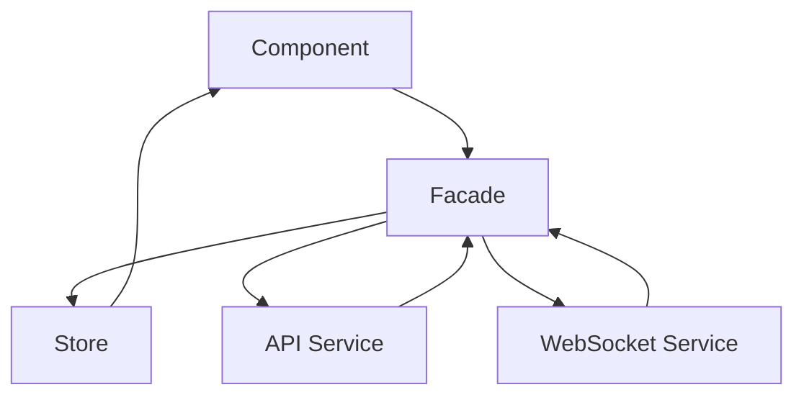

## Overview

The Rodando Driver app uses **NgRx Signal Store** with the **Facade pattern** for state management. This approach combines the power of Angular Signals with clean architectural patterns for maintainable, reactive state.

<Info>
  **NgRx Signals** provide fine-grained reactivity without the boilerplate of traditional NgRx Store, while maintaining type safety and predictability.
</Info>

## Architecture Pattern

The state management follows a layered architecture:



<Steps>
  <Step title="Component">
    Consumes state via facades, dispatches actions
  </Step>
  
  <Step title="Facade">
    Orchestrates business logic, coordinates services and stores
  </Step>
  
  <Step title="Store">
    Holds reactive state using Angular Signals
  </Step>
  
  <Step title="Services">
    Handle external I/O (HTTP, WebSocket, Storage)
  </Step>
</Steps>

## Store Structure

```plaintext
src/app/store/
├── auth/
│   ├── auth.store.ts         # Signal-based state
│   ├── auth.facade.ts        # Business logic orchestration
│   ├── auth.selectors.ts     # Computed selectors
│   ├── login.store.ts        # Login-specific state
│   └── models.ts             # TypeScript interfaces
├── driver-availability/
│   ├── driver.store.ts
│   └── driver.facade.ts
├── trip/
│   ├── trip.store.ts
│   └── trip.facade.ts
├── notification-alerts/
│   ├── notification-alert.actions.ts
│   └── notification-alert.effects.ts
├── sessions/
│   ├── sessions.store.ts
│   └── sessions.facade.ts
├── users/
│   ├── register.store.ts
│   ├── users.facade.ts
│   ├── user.selectors.ts
│   └── models.ts
└── index.ts                  # Barrel exports
```

## Signal Store Pattern

### Store Definition

A signal store manages a specific domain's state:

```typescript:src/app/store/auth/auth.store.ts
import { Injectable, signal, computed } from '@angular/core';
import type { UserProfile } from '../../core/models/user/user.response';
import { SessionType } from 'src/app/core/models/auth/auth.auxiliary';

export interface AuthState {
  accessToken: string | null;
  refreshTokenInMemory: string | null;
  user: UserProfile | null;
  loading: boolean;
  error: any | null;
  sessionType?: SessionType | null;
  accessTokenExpiresAt?: number | null;
  refreshTokenExpiresAt?: number | null;
  sid?: string | null;
  refreshInProgress?: boolean;
}

const initialState: AuthState = {
  accessToken: null,
  refreshTokenInMemory: null,
  user: null,
  loading: false,
  error: null,
  sessionType: null,
  accessTokenExpiresAt: null,
  refreshTokenExpiresAt: null,
  sid: null,
  refreshInProgress: false,
};

@Injectable({ providedIn: 'root' })
export class AuthStore {
  private readonly _state = signal<AuthState>({ ...initialState });

  // Computed selectors
  readonly accessToken = computed(() => this._state().accessToken);
  readonly user = computed(() => this._state().user);
  readonly loading = computed(() => this._state().loading);
  readonly error = computed(() => this._state().error);
  
  readonly isAuthenticated = computed(() => {
    const token = this._state().accessToken;
    const user = this._state().user;
    const exp = this._state().accessTokenExpiresAt ?? 0;
    return !!token && !!user && exp > Date.now();
  });

  // Mutations
  setAccessToken(token: string | null) {
    this._state.update(s => ({ ...s, accessToken: token }));
  }

  setUser(user: UserProfile | null) {
    this._state.update(s => ({ ...s, user }));
  }

  setAuth(payload: Partial<AuthState>) {
    this._state.update(s => ({
      ...s,
      accessToken: payload.accessToken ?? s.accessToken,
      user: payload.user ?? s.user,
      sessionType: payload.sessionType ?? s.sessionType,
      // ...
    }));
  }

  clear() {
    this._state.set({ ...initialState });
  }
}
```

<Note>
  **Key Concepts**:
  - `signal<T>()` - Writable reactive state
  - `computed()` - Derived state (memoized)
  - `update()` - Immutable state updates
  - `set()` - Replace entire state
</Note>

### Trip Store Example

Complex state with nested properties:

```typescript:src/app/store/trip/trip.store.ts
import { Injectable, computed, signal } from '@angular/core';
import { TripDto } from '@/app/features/trip/interfaces/trip.interface';

export type TripPhase =
  | 'idle'
  | 'assigned'
  | 'arriving'
  | 'in_progress'
  | 'completed'
  | 'cancelled'
  | 'no_drivers_found';

export interface DriverTripState {
  status: 'idle' | 'loading' | 'success' | 'error';
  error: string | null;
  
  activeTripId: string | null;
  trip: TripDto | null;
  phase: TripPhase;
  offerAssignmentId: string | null;
  
  offerExpiresAt?: string | null;
  remainingSec: number | null;
  
  modalOpen: boolean;
  handledAssignments: string[];
  
  passengerSlim: {
    id: string;
    name: string | null;
    phoneMasked: string | null;
    photoUrl: string | null;
  } | null;
  
  // Pricing & waiting
  baseFare: number | null;
  baseCurrency: string | null;
  liveFare: number | null;
  waitingSinceAt: string | null;
  waitingSeconds: number;
  waitingPenaltyApplied: boolean;
  waitingPenaltyText: string | null;
  waitingExtraFare: number | null;
  waitingReason: string | null;
}

@Injectable({ providedIn: 'root' })
export class TripStore {
  private _s = signal<DriverTripState>({ /* initial */ });

  // Selectors
  readonly state = computed(() => this._s());
  readonly trip = computed(() => this._s().trip);
  readonly phase = computed(() => this._s().phase);
  readonly liveFare = computed(() => this._s().liveFare ?? this._s().baseFare);
  
  // Complex computed
  readonly modalVm = computed(() => {
    const s = this._s();
    const t = s.trip;
    
    return {
      phase: s.phase,
      remainingSec: s.remainingSec ?? 0,
      originLabel: t?.pickupAddress || '—',
      destinationLabel: t?.stops?.[0]?.address || '—',
      distanceText: `${t?.fareDistanceKm?.toFixed(1)} km`,
      priceText: `${t?.fareEstimatedTotal} ${t?.fareFinalCurrency}`,
    };
  });

  // Mutations
  setTrip(trip: TripDto | null) {
    this._s.update(s => ({ ...s, trip, status: 'success' }));
  }
  
  setPhase(p: TripPhase) {
    this._s.update(s => ({ ...s, phase: p }));
  }
  
  tickCountdown() {
    this._s.update(s => ({
      ...s,
      remainingSec: (s.remainingSec ?? 0) > 0 ? (s.remainingSec! - 1) : 0
    }));
  }
  
  applyWaitingPenalty(extra: number, text: string) {
    this._s.update(s => {
      const base = s.baseFare ?? 0;
      const live = base + (extra || 0);
      return {
        ...s,
        liveFare: live,
        waitingExtraFare: extra,
        waitingPenaltyApplied: true,
        waitingPenaltyText: text,
      };
    });
  }

  reset() { this._s.set({ /* initial */ }); }
}
```

<Warning>
  **Immutability**: Always use `update(s => ({ ...s, ... }))` to maintain immutability. Direct mutation breaks reactivity.
</Warning>

## Facade Pattern

### Facade Responsibilities

1. **Orchestrate** business logic
2. **Coordinate** multiple stores and services
3. **Handle** side effects (HTTP, WebSocket, timers)
4. **Expose** simplified API to components

### Auth Facade Example

```typescript:src/app/store/auth/auth.facade.ts
import { inject, Injectable } from "@angular/core";
import { Router } from "@angular/router";
import { Platform } from '@ionic/angular';
import { Observable, from, switchMap, catchError, tap } from 'rxjs';

import { AuthStore } from "./auth.store";
import { AuthService } from "src/app/core/services/http/auth.service";
import { SecureStorageService } from "src/app/core/services/http/secure-storage.service";

@Injectable({ providedIn: 'root' })
export class AuthFacade {
  private readonly authStore = inject(AuthStore);
  private readonly authService = inject(AuthService);
  private readonly router = inject(Router);
  private readonly secureStorage = inject(SecureStorageService);
  private readonly platform = inject(Platform);

  /**
   * Login: authenticate and update state
   * - Web: backend sets HttpOnly cookie (refreshToken)
   * - Mobile: backend returns { accessToken, refreshToken }
   */
  login(payload: LoginPayload): Observable<User> {
    this.authStore.setLoading(true);

    return this.authService.login(payload, { withCredentials: true })
      .pipe(
        switchMap((res: LoginResponse) => {
          const sessionType = res.sessionType ?? null;
          const usesCookie = !('refreshToken' in res && res.refreshToken);

          if (!usesCookie) {
            // Mobile: save refreshToken to secure storage
            const { accessToken, refreshToken } = res;
            return from(
              this.setAccessTokenWithExp({
                accessToken,
                refreshToken,
                sessionType,
              })
            ).pipe(
              switchMap(() => 
                this.secureStorage.save('refreshToken', refreshToken)
              ),
              switchMap(() => this.authService.me(false))
            );
          } else {
            // Web: refreshToken in cookie
            const { accessToken } = res;
            return from(
              this.setAccessTokenWithExp({ accessToken, sessionType })
            ).pipe(
              switchMap(() => this.authService.me(true))
            );
          }
        }),
        tap((user) => {
          this.authStore.setUser(user);
          this.router.navigate(['/home']);
        }),
        catchError((err) => {
          this.authStore.setError(err);
          throw err;
        })
      );
  }

  /**
   * Refresh access token (silent refresh)
   */
  performRefresh(): Observable<string> {
    const snap = this.authStore.getSnapshot();
    const usesCookie = snap.sessionType === 'web';

    let refreshRequest$: Observable<RefreshResponse>;

    if (usesCookie) {
      // Cookie-based refresh
      refreshRequest$ = this.authService.refresh(undefined, true);
    } else {
      // Mobile: load refreshToken from secure storage
      refreshRequest$ = from(
        this.secureStorage.load('refreshToken')
      ).pipe(
        switchMap(rt => {
          if (!rt) throw new Error('No refresh token available');
          return this.authService.refresh(rt, false);
        })
      );
    }

    return refreshRequest$.pipe(
      switchMap((res) => {
        const { accessToken, refreshToken } = res;
        return from(
          this.setAccessTokenWithExp({
            accessToken,
            refreshToken,
          })
        ).pipe(
          switchMap(() => this.authService.me(usesCookie)),
          tap(user => this.authStore.setUser(user)),
          map(() => accessToken)
        );
      }),
      catchError(async (err) => {
        await this.clearAll();
        throw err;
      })
    );
  }

  /**
   * Schedule auto-refresh before token expires
   */
  private scheduleAutoRefresh(expiresAt?: number | null): void {
    if (!expiresAt) return;

    const ttl = Math.max(0, expiresAt - Date.now());
    const offset = Math.min(30_000, Math.floor(ttl / 2));
    const msUntilRefresh = ttl - offset;

    if (msUntilRefresh <= 0) {
      // Immediate refresh
      this.performRefresh().subscribe();
      return;
    }

    // Schedule refresh
    this.refreshTimerId = setTimeout(() => {
      this.performRefresh().subscribe();
    }, msUntilRefresh);
  }

  /**
   * Clear all state and redirect to login
   */
  async clearAll(): Promise<void> {
    this.clearAutoRefresh();
    await this.secureStorage.remove('refreshToken');
    this.authStore.clear();
    await this.router.navigateByUrl('/auth/login');
  }
}
```

<Info>
  **Facade Benefits**:
  - **Encapsulation**: Components don't know about internal state structure
  - **Testability**: Easy to mock facades in tests
  - **Maintainability**: Business logic centralized, not scattered in components
</Info>

### Trip Facade Example

Orchestrates WebSocket events, HTTP calls, and UI state:

```typescript:src/app/store/trip/trip.facade.ts
import { inject, Injectable } from "@angular/core";
import { interval, Subscription } from "rxjs";

import { TripStore } from "./trip.store";
import { TripApiService } from "@/app/core/services/http/trip-api.service";
import { DriverWsService } from "@/app/core/services/socket/driver-ws.service.ts";
import { Router } from "@angular/router";

@Injectable({ providedIn: 'root' })
export class TripFacade {
  private store = inject(TripStore);
  private tripsApi = inject(TripApiService);
  private ws = inject(DriverWsService);
  private router = inject(Router);

  private countdownSub?: Subscription;

  constructor() {
    // Subscribe to WebSocket events
    this.ws.onOffer$.subscribe(async (offer) => {
      if (this.store.state().phase !== 'idle') return;

      this.store.setActiveTripId(offer.tripId);
      this.store.setPhase('assigned');
      await this.refreshTrip();
      this.startCountdown({ expiresAtIso: offer.expiresAt, ttlSec: offer.ttlSec });
    });

    this.ws.onDriverAssigned$.subscribe(async (p) => {
      this.store.setPhase('assigned');
      if (p.passenger) {
        this.store.setPassengerSlim({
          id: p.passenger.id,
          name: p.passenger.name,
          phoneMasked: p.passenger.phoneMasked,
          photoUrl: p.passenger.photoUrl,
        });
      }
      await this.refreshTrip();
    });

    this.ws.onTripStarted$.subscribe(async (p) => {
      this.store.setPhase('in_progress');
      await this.refreshTrip();
    });

    this.ws.onTripCompleted$.subscribe(async (p) => {
      this.store.setPhase('completed');
      await this.refreshTrip();
    });
  }

  // Public API
  vm() { return this.store.state(); }
  modalVm = this.store.modalVm;

  async acceptOffer(): Promise<void> {
    const assignmentId = this.store.state().offerAssignmentId;
    if (!assignmentId) return;

    this.stopCountdown();
    await this.tripsApi.acceptAssignment(assignmentId).toPromise();
    this.store.setPhase('assigned');
    await this.router.navigate(['/trips/active']);
  }

  async startTrip(): Promise<void> {
    const tripId = this.store.state().activeTripId;
    await this.tripsApi.startTrip(tripId, driverId).toPromise();
    this.store.setPhase('in_progress');
  }

  private startCountdown(opts: { expiresAtIso?: string; ttlSec?: number }) {
    this.stopCountdown();
    const remaining = Math.max(0, Math.floor((Date.parse(opts.expiresAtIso) - Date.now()) / 1000));
    this.store.setOfferCountdown(opts.expiresAtIso ?? null, remaining);

    this.countdownSub = interval(1000).subscribe(() => {
      this.store.tickCountdown();
      if (this.store.state().remainingSec <= 0) {
        this.stopCountdown();
      }
    });
  }

  private stopCountdown() {
    this.countdownSub?.unsubscribe();
  }
}
```

## Signals Deep Dive

### Signal Basics

```typescript
import { signal, computed, effect } from '@angular/core';

// Writable signal
const count = signal(0);
console.log(count());      // 0
count.set(10);             // Replace value
count.update(v => v + 1);  // Update based on current

// Computed signal (readonly, memoized)
const doubled = computed(() => count() * 2);
console.log(doubled());    // 22

// Effect (side effects when dependencies change)
effect(() => {
  console.log('Count changed:', count());
});
```

### Component Integration

```typescript
import { Component, inject } from '@angular/core';
import { AuthStore } from '@/app/store/auth/auth.store';
import { AsyncPipe, JsonPipe } from '@angular/common';

@Component({
  selector: 'app-profile',
  template: `
    <div>
      <h1>Welcome, {{ auth.user()?.email }}</h1>
      <p>Authenticated: {{ auth.isAuthenticated() }}</p>
      <p>Loading: {{ auth.loading() }}</p>
    </div>
  `,
  standalone: true,
})
export class ProfileComponent {
  protected auth = inject(AuthStore);
  
  // Signals are automatically tracked in templates
  // No need for AsyncPipe or manual subscriptions!
}
```

<Note>
  **Signal Tracking**: Angular automatically subscribes to signals used in templates and re-renders when they change.
</Note>

### Async Operations

Combine signals with RxJS for async workflows:

```typescript
import { toObservable, toSignal } from '@angular/core/rxjs-interop';

export class MyComponent {
  private auth = inject(AuthStore);
  
  // Convert signal to observable
  user$ = toObservable(this.auth.user);
  
  // Convert observable to signal
  trips = toSignal(this.tripsApi.getAll(), { initialValue: [] });
}
```

## State Patterns

### Loading States

```typescript
export interface LoadingState<T> {
  status: 'idle' | 'loading' | 'success' | 'error';
  data: T | null;
  error: string | null;
}

// Usage
setLoading() {
  this._state.update(s => ({ ...s, status: 'loading', error: null }));
}

setSuccess(data: T) {
  this._state.update(s => ({ ...s, status: 'success', data, error: null }));
}

setError(error: string) {
  this._state.update(s => ({ ...s, status: 'error', error }));
}
```

### Optimistic Updates

```typescript
async updateProfile(profile: Partial<UserProfile>) {
  // Optimistic update
  const prev = this.store.user();
  this.store.setUser({ ...prev, ...profile });

  try {
    const updated = await this.api.updateProfile(profile).toPromise();
    this.store.setUser(updated);
  } catch (err) {
    // Rollback on error
    this.store.setUser(prev);
    throw err;
  }
}
```

### Derived State

```typescript
readonly canStartTrip = computed(() => {
  const phase = this._state().phase;
  const arrived = this._state().arrivedPickupAt;
  return phase === 'arriving' && !!arrived;
});

readonly totalFare = computed(() => {
  const base = this._state().baseFare ?? 0;
  const extra = this._state().waitingExtraFare ?? 0;
  return base + extra;
});
```

## Best Practices

<CardGroup cols={2}>
  <Card title="Keep stores focused" icon="bullseye">
    Each store manages a single domain. Don't create god stores.
  </Card>
  
  <Card title="Use computed for derivations" icon="calculator">
    Never duplicate state. Derive it with `computed()`.
  </Card>
  
  <Card title="Facades orchestrate" icon="sitemap">
    Business logic goes in facades, not components or stores.
  </Card>
  
  <Card title="Immutability matters" icon="lock">
    Always use `update(s => ({ ...s, ... }))` for state changes.
  </Card>
</CardGroup>

## Performance Considerations

### Memoization

Computed signals are memoized and only recompute when dependencies change:

```typescript
readonly expensiveComputation = computed(() => {
  const data = this._state().data;
  // Only runs when data changes
  return data.map(heavy => processHeavy(heavy));
});
```

### Equality Checks

Signals use `Object.is()` for equality:

```typescript
// This won't trigger updates (same reference)
this._state.update(s => s);

// This will (new object)
this._state.update(s => ({ ...s }));
```

## Testing

### Testing Stores

```typescript
import { TestBed } from '@angular/core/testing';
import { AuthStore } from './auth.store';

describe('AuthStore', () => {
  let store: AuthStore;

  beforeEach(() => {
    TestBed.configureTestingModule({ providers: [AuthStore] });
    store = TestBed.inject(AuthStore);
  });

  it('should initialize with null user', () => {
    expect(store.user()).toBeNull();
  });

  it('should set user', () => {
    const user = { id: '1', email: 'test@example.com' };
    store.setUser(user);
    expect(store.user()).toEqual(user);
  });

  it('should compute isAuthenticated', () => {
    expect(store.isAuthenticated()).toBe(false);
    store.setAuth({
      accessToken: 'token',
      user: { id: '1' },
      accessTokenExpiresAt: Date.now() + 10000,
    });
    expect(store.isAuthenticated()).toBe(true);
  });
});
```

### Testing Facades

```typescript
import { TestBed } from '@angular/core/testing';
import { AuthFacade } from './auth.facade';
import { AuthStore } from './auth.store';
import { AuthService } from '../../core/services/http/auth.service';

describe('AuthFacade', () => {
  let facade: AuthFacade;
  let authService: jasmine.SpyObj<AuthService>;

  beforeEach(() => {
    const authServiceSpy = jasmine.createSpyObj('AuthService', ['login', 'refresh']);

    TestBed.configureTestingModule({
      providers: [
        AuthFacade,
        AuthStore,
        { provide: AuthService, useValue: authServiceSpy },
      ],
    });

    facade = TestBed.inject(AuthFacade);
    authService = TestBed.inject(AuthService) as jasmine.SpyObj<AuthService>;
  });

  it('should login successfully', async () => {
    authService.login.and.returnValue(of({ accessToken: 'token' }));
    
    await firstValueFrom(facade.login({ email: 'test@test.com', password: 'pass' }));
    
    expect(authService.login).toHaveBeenCalled();
  });
});
```

## Related Documentation

<CardGroup cols={2}>
  <Card title="Architecture Overview" icon="sitemap" href="/development/architecture-overview">
    Learn about the overall app architecture.
  </Card>
  
  <Card title="WebSocket Integration" icon="wifi" href="/development/websocket-integration">
    How WebSocket events update state.
  </Card>
  
  <Card title="Routing Structure" icon="route" href="/development/routing-structure">
    How guards interact with auth state.
  </Card>
</CardGroup>
