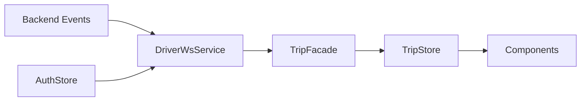
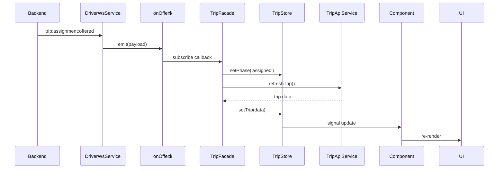

## Overview

The Rodando Driver app uses **Socket.io** for real-time bidirectional communication with the backend. WebSocket integration enables instant trip offers, live status updates, and real-time coordination between drivers and passengers.

<Info>
  **Socket.io** provides automatic reconnection, fallback to HTTP long-polling, and a robust event-based API for real-time features.
</Info>

## Architecture



<Steps>
  <Step title="Backend emits event">
    Server broadcasts trip events to connected drivers.
  </Step>
  
  <Step title="DriverWsService receives">
    Socket.io client receives and routes events to Subjects.
  </Step>
  
  <Step title="Facade handles business logic">
    TripFacade subscribes to event streams and orchestrates responses.
  </Step>
  
  <Step title="Store updates state">
    State changes trigger UI updates via Angular Signals.
  </Step>
</Steps>

## DriverWsService

The core WebSocket service managing connection and events:

```typescript:src/app/core/services/socket/driver-ws.service.ts.ts
import { Injectable, inject } from '@angular/core';
import { io, Socket } from 'socket.io-client';
import { BehaviorSubject, Subject } from 'rxjs';
import { environment } from 'src/environments/environment';
import { AuthStore } from "../../../store/auth/auth.store";

type OfferPayload = {
  assignmentId: string;
  tripId: string;
  ttlSec: number;
  expiresAt: string;  // ISO timestamp
};

type DriverAssignedPayload = {
  tripId: string;
  driverId: string;
  vehicleId: string;
  at: string;
  currentStatus: 'accepted';
  passenger?: {
    id: string;
    name: string | null;
    photoUrl: string | null;
    phoneMasked: string | null;
  } | null;
};

type TripStartedPayload = {
  tripId: string;
  at: string;
  currentStatus: 'in_progress';
};

type TripCompletedPayload = {
  tripId: string;
  at: string;
  currentStatus: 'completed';
  fareTotal?: number | null;
  currency?: string | null;
};

type TripCancelledPayload = {
  tripId: string;
  at: string;
  currentStatus: 'cancelled';
  reason?: string | null;
};

@Injectable({ providedIn: 'root' })
export class DriverWsService {
  private auth = inject(AuthStore);
  private socket?: Socket;

  // Connection state
  private connected$ = new BehaviorSubject<boolean>(false);
  readonly onConnected$ = this.connected$.asObservable();

  // Event streams
  readonly onOffer$ = new Subject<OfferPayload>();
  readonly onDriverAssigned$ = new Subject<DriverAssignedPayload>();
  readonly onArrivingStarted$ = new Subject<ArrivingStartedPayload>();
  readonly onTripStarted$ = new Subject<TripStartedPayload>();
  readonly onTripCompleted$ = new Subject<TripCompletedPayload>();
  readonly onTripCancelled$ = new Subject<TripCancelledPayload>();

  connect(): void {
    if (this.socket?.connected) return;

    this.socket = io(`${environment.wsBase}/drivers`, {
      transports: ['websocket'],
      auth: { token: this.auth.accessToken?.() || '' },
      reconnection: true,
      reconnectionAttempts: Infinity,
      reconnectionDelayMax: 5000,
    });

    // Refresh token on reconnect attempts
    this.socket.io.on('reconnect_attempt', () => {
      this.socket!.auth = { token: this.auth.accessToken?.() || '' };
    });

    // Debug: log all events
    this.socket.onAny((evt, ...args) => 
      console.log('[WS] >>>', evt, ...args)
    );

    // Connection lifecycle
    this.socket.on('connect', () => this.connected$.next(true));
    this.socket.on('disconnect', () => this.connected$.next(false));
    this.socket.on('connect_error', (e: any) => 
      console.warn('[WS] err', e?.message)
    );

    // Trip events
    this.socket.on('trip:assignment:offered', (p: OfferPayload) => {
      console.log('[WS] trip:assignment:offered', p);
      this.onOffer$.next(p);
    });

    this.socket.on('trip:driver_assigned', (p: DriverAssignedPayload) => {
      console.log('[WS] trip:driver_assigned', p);
      this.onDriverAssigned$.next(p);
    });

    this.socket.on('trip:arriving_started', (p: ArrivingStartedPayload) => {
      console.log('[WS] trip:arriving_started', p);
      this.onArrivingStarted$.next(p);
    });

    this.socket.on('trip:started', (p: TripStartedPayload) => {
      console.log('[WS] trip:started', p);
      this.onTripStarted$.next(p);
    });

    this.socket.on('trip:completed', (p: TripCompletedPayload) => {
      console.log('[WS] trip:completed', p);
      this.onTripCompleted$.next(p);
    });

    this.socket.on('trip:cancelled', (p: TripCancelledPayload) => {
      console.log('[WS] trip:cancelled', p);
      this.onTripCancelled$.next(p);
    });
  }

  disconnect(): void {
    try {
      this.socket?.removeAllListeners();
      this.socket?.disconnect();
      console.log('[WS] disconnect() called');
    } catch {}
    this.connected$.next(false);
  }
}
```

<Warning>
  **Authentication**: The WebSocket connection uses JWT authentication. The token is refreshed automatically on reconnection attempts.
</Warning>

## Event Types

The service handles six core event types:

### 1. Trip Assignment Offered

**Event**: `trip:assignment:offered`  
**When**: Backend matches driver to a new trip request  
**Payload**:

```typescript
{
  assignmentId: "asgn_xyz123",
  tripId: "trip_abc456",
  ttlSec: 20,                    // Seconds to accept
  expiresAt: "2024-03-09T15:30:00Z"
}
```

**Handler**:

```typescript:src/app/store/trip/trip.facade.ts
this.ws.onOffer$.subscribe(async (offer) => {
  if (this.store.state().phase !== 'idle') {
    console.log('[TripFacade] ignoring offer, driver busy');
    return;
  }

  this.store.setActiveTripId(offer.tripId);
  this.store.setOfferAssignmentId(offer.assignmentId);
  this.store.setPhase('assigned');

  await this.refreshTrip();
  this.startCountdown({
    expiresAtIso: offer.expiresAt,
    ttlSec: offer.ttlSec,
  });

  await this.modalSvc.open();  // Show offer modal
});
```

### 2. Driver Assigned

**Event**: `trip:driver_assigned`  
**When**: Driver accepts the trip  
**Payload**:

```typescript
{
  tripId: "trip_abc456",
  driverId: "drv_789",
  vehicleId: "veh_321",
  at: "2024-03-09T15:30:10Z",
  currentStatus: "accepted",
  passenger: {
    id: "pax_111",
    name: "Juan Pérez",
    photoUrl: "https://...",
    phoneMasked: "+53 5*** **12"
  }
}
```

**Handler**:

```typescript:src/app/store/trip/trip.facade.ts
this.ws.onDriverAssigned$.subscribe(async (p) => {
  console.log('[TripFacade] onDriverAssigned$', p);
  this.store.setActiveTripId(p.tripId);
  this.store.setPhase('assigned');

  if (p.passenger) {
    this.store.setPassengerSlim({
      id: p.passenger.id,
      name: p.passenger.name,
      phoneMasked: p.passenger.phoneMasked,
      photoUrl: p.passenger.photoUrl,
    });
  }

  await this.refreshTrip();
});
```

### 3. Arriving Started

**Event**: `trip:arriving_started`  
**When**: Driver confirms arrival at pickup location  
**Payload**:

```typescript
{
  snapshot: {
    tripId: "trip_abc456",
    passengerId: "pax_111"
  },
  at: "2024-03-09T15:35:00Z"
}
```

**Handler**:

```typescript:src/app/store/trip/trip.facade.ts
this.ws.onArrivingStarted$.subscribe(async (ev) => {
  console.log('[TripFacade] onArrivingStarted$', ev);
  const active = this.store.state().activeTripId;
  if (!active || ev.snapshot.tripId !== active) return;
  
  this.store.setPhase('arriving');
  await this.modalSvc.close('arriving');
  await this.refreshTrip();
});
```

### 4. Trip Started

**Event**: `trip:started`  
**When**: Driver starts the trip (passenger onboard)  
**Payload**:

```typescript
{
  tripId: "trip_abc456",
  at: "2024-03-09T15:40:00Z",
  currentStatus: "in_progress"
}
```

**Handler**:

```typescript:src/app/store/trip/trip.facade.ts
this.ws.onTripStarted$.subscribe(async (p) => {
  console.log('[TripFacade] onTripStarted$', p);
  const active = this.store.state().activeTripId;
  if (!active || p.tripId !== active) return;

  this.store.setPhase('in_progress');
  await this.refreshTrip();
});
```

### 5. Trip Completed

**Event**: `trip:completed`  
**When**: Driver completes the trip  
**Payload**:

```typescript
{
  tripId: "trip_abc456",
  at: "2024-03-09T16:00:00Z",
  currentStatus: "completed",
  fareTotal: 150.50,
  currency: "CUP"
}
```

**Handler**:

```typescript:src/app/store/trip/trip.facade.ts
this.ws.onTripCompleted$.subscribe(async (p) => {
  console.log('[TripFacade] onTripCompleted$', p);
  const active = this.store.state().activeTripId;
  if (!active || p.tripId !== active) return;

  this.store.setPhase('completed');
  await this.refreshTrip();
  // Driver can view trip summary
});
```

### 6. Trip Cancelled

**Event**: `trip:cancelled`  
**When**: Trip is cancelled (by driver or passenger)  
**Payload**:

```typescript
{
  tripId: "trip_abc456",
  at: "2024-03-09T15:38:00Z",
  currentStatus: "cancelled",
  reason: "Passenger cancelled"
}
```

**Handler**:

```typescript:src/app/store/trip/trip.facade.ts
this.ws.onTripCancelled$.subscribe(async (p) => {
  console.log('[TripFacade] onTripCancelled$', p);
  const active = this.store.state().activeTripId;
  if (!active || p.tripId !== active) return;

  this.store.setPhase('cancelled');
  await this.refreshTrip();
});
```

## Connection Lifecycle

### Initialization

Connect to WebSocket when user logs in:

```typescript:src/app/store/auth/auth.facade.ts
login(payload: LoginPayload): Observable<User> {
  return this.authService.login(payload).pipe(
    tap(async (user) => {
      this.authStore.setUser(user);
      
      // Connect to WebSocket after successful login
      this.wsService.connect();
      
      await this.router.navigate(['/home']);
    })
  );
}
```

### Reconnection

Socket.io automatically reconnects with exponential backoff:

```typescript
this.socket = io(url, {
  reconnection: true,
  reconnectionAttempts: Infinity,
  reconnectionDelayMax: 5000,  // Max 5 seconds between attempts
});

// Refresh auth token on reconnect
this.socket.io.on('reconnect_attempt', () => {
  this.socket!.auth = { token: this.auth.accessToken?.() || '' };
});
```

<Info>
  **Token Refresh**: The connection automatically updates the JWT token before each reconnection attempt, ensuring uninterrupted service even if the token expires.
</Info>

### Cleanup

Disconnect when user logs out:

```typescript:src/app/store/auth/auth.facade.ts
async clearAll(): Promise<void> {
  // Disconnect WebSocket
  this.wsService.disconnect();
  
  // Clear auth state
  this.authStore.clear();
  await this.secureStorage.remove('refreshToken');
  await this.router.navigateByUrl('/auth/login');
}
```

## Integration with State Management

WebSocket events flow into the state management layer:



### Example: Full Event Flow

```typescript:src/app/store/trip/trip.facade.ts
constructor() {
  // Subscribe to WebSocket event
  this.ws.onOffer$.subscribe(async (offer) => {
    // 1. Check if driver is available
    const s = this.store.state();
    if (s.phase !== 'idle') {
      console.log('[TripFacade] ignoring offer, driver busy');
      return;
    }

    // 2. Update state
    this.store.setActiveTripId(offer.tripId);
    this.store.setOfferAssignmentId(offer.assignmentId);
    this.store.setPhase('assigned');

    // 3. Fetch full trip details from API
    await this.refreshTrip();

    // 4. Start countdown timer
    this.startCountdown({
      expiresAtIso: offer.expiresAt,
      ttlSec: offer.ttlSec,
    });

    // 5. Show modal to driver
    await this.modalSvc.open();
  });
}

private async refreshTrip(): Promise<void> {
  const id = this.store.state().activeTripId;
  if (!id) return;

  this.store.setLoading();

  const trip = await this.tripsApi.getById(id)
    .pipe(take(1), catchError(() => of(null)))
    .toPromise();

  if (trip) {
    this.store.setTrip(trip);
    const baseFare = trip.fareEstimatedTotal ?? trip.fareFinalTotal;
    this.store.setInitialFare(baseFare, trip.fareFinalCurrency);
  } else {
    this.store.setError('No se pudo cargar el viaje');
  }
}
```

## Error Handling

### Connection Errors

```typescript
this.socket.on('connect_error', (e: any) => {
  console.warn('[WS] Connection error:', e?.message);
  
  // Common causes:
  // - Invalid JWT token
  // - Network issues
  // - Backend unavailable
  
  // Socket.io will auto-retry with exponential backoff
});
```

### Event Errors

Wrap event handlers in try-catch:

```typescript
this.ws.onOffer$.subscribe(async (offer) => {
  try {
    await this.handleOffer(offer);
  } catch (err) {
    console.error('[TripFacade] Error handling offer:', err);
    this.store.setError('No se pudo procesar la oferta');
  }
});
```

## Debugging

### Enable debug logging

The service logs all WebSocket events:

```typescript
// Debug: log all incoming events
this.socket.onAny((evt, ...args) => {
  console.log('[WS] >>>', evt, ...args);
});
```

**Example output**:
```
[WS] >>> connect
[WS] >>> trip:assignment:offered { assignmentId: 'asgn_123', tripId: 'trip_456', ... }
[WS] >>> trip:driver_assigned { tripId: 'trip_456', driverId: 'drv_789', ... }
```

### Connection status

Subscribe to connection state:

```typescript
export class StatusComponent implements OnInit {
  private ws = inject(DriverWsService);
  
  ngOnInit() {
    this.ws.onConnected$.subscribe(connected => {
      console.log('WebSocket connected:', connected);
      // Update UI indicator
    });
  }
}
```

## Performance Considerations

### Event Filtering

Always validate events before processing:

```typescript
this.ws.onTripStarted$.subscribe(async (p) => {
  const active = this.store.state().activeTripId;
  
  // Ignore events for other trips
  if (!active || p.tripId !== active) {
    console.log('[TripFacade] Ignoring event for different trip');
    return;
  }
  
  // Process event
  this.store.setPhase('in_progress');
});
```

### Memory Leaks

Unsubscribe when component/service destroys:

```typescript
export class TripComponent implements OnDestroy {
  private destroy$ = new Subject<void>();
  
  ngOnInit() {
    this.ws.onOffer$
      .pipe(takeUntil(this.destroy$))
      .subscribe(offer => this.handleOffer(offer));
  }
  
  ngOnDestroy() {
    this.destroy$.next();
    this.destroy$.complete();
  }
}
```

## Testing

### Mock WebSocket Service

```typescript
import { Subject } from 'rxjs';

class MockDriverWsService {
  onOffer$ = new Subject<OfferPayload>();
  onDriverAssigned$ = new Subject<DriverAssignedPayload>();
  onTripStarted$ = new Subject<TripStartedPayload>();
  
  connect = jasmine.createSpy('connect');
  disconnect = jasmine.createSpy('disconnect');
}

describe('TripFacade', () => {
  let facade: TripFacade;
  let mockWs: MockDriverWsService;
  
  beforeEach(() => {
    TestBed.configureTestingModule({
      providers: [
        TripFacade,
        { provide: DriverWsService, useClass: MockDriverWsService },
      ],
    });
    
    facade = TestBed.inject(TripFacade);
    mockWs = TestBed.inject(DriverWsService) as any;
  });
  
  it('should handle trip offer', () => {
    const offer: OfferPayload = {
      assignmentId: 'asgn_123',
      tripId: 'trip_456',
      ttlSec: 20,
      expiresAt: new Date(Date.now() + 20000).toISOString(),
    };
    
    mockWs.onOffer$.next(offer);
    
    expect(facade.vm().phase).toBe('assigned');
    expect(facade.vm().activeTripId).toBe('trip_456');
  });
});
```

## Best Practices

<CardGroup cols={2}>
  <Card title="Always validate events" icon="shield">
    Check tripId matches active trip before processing.
  </Card>
  
  <Card title="Handle reconnections gracefully" icon="rotate">
    Refresh tokens and resync state after reconnect.
  </Card>
  
  <Card title="Log all events in dev" icon="bug">
    Use `onAny()` for comprehensive debugging.
  </Card>
  
  <Card title="Clean up subscriptions" icon="trash">
    Use `takeUntil()` to prevent memory leaks.
  </Card>
</CardGroup>

## Security

### JWT Authentication

Every WebSocket connection is authenticated:

```typescript
this.socket = io(url, {
  auth: { token: this.auth.accessToken?.() || '' },
});
```

### Token Refresh

Automatically update token on reconnect:

```typescript
this.socket.io.on('reconnect_attempt', () => {
  // Get fresh token from store
  this.socket!.auth = { token: this.auth.accessToken?.() || '' };
});
```

<Warning>
  **Important**: Never send sensitive data (passwords, payment info) over WebSocket. Use HTTPS API endpoints for sensitive operations.
</Warning>

## Related Documentation

<CardGroup cols={2}>
  <Card title="State Management" icon="database" href="/development/state-management">
    How WebSocket events update application state.
  </Card>
  
  <Card title="Trip Flow" icon="car" href="/features/trip-flow">
    Complete trip lifecycle from offer to completion.
  </Card>
  
  <Card title="Architecture Overview" icon="sitemap" href="/development/architecture-overview">
    Learn about the overall app architecture.
  </Card>
  
  <Card title="API Reference" icon="plug" href="/api-reference/websocket-events">
    Complete WebSocket event reference.
  </Card>
</CardGroup>
