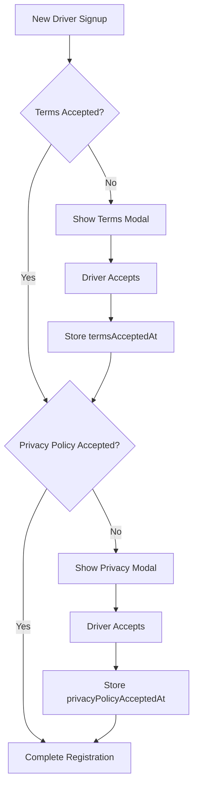

The driver profile system manages all driver-related information including personal details, vehicle information, account settings, and verification status. This data is essential for trip matching, regulatory compliance, and customer trust.

## User Profile Model

The app uses several user models depending on the context:

### UserProfile (Basic)

Used for authentication and basic profile display:

```typescript
interface UserProfile {
  id: string | null;
  name: string | null;
  email: string | null;
  phoneNumber?: string | null;
  profilePictureUrl?: string | null;
  createdAt?: string;
}
```

**Retrieving Profile:**

```typescript
me(useCookie: boolean = true): Observable<UserProfile> {
  const url = `${this.baseUrl}/users/profile`;
  const options = useCookie ? { withCredentials: true } : {};
  return this.http
    .get<{ success: boolean; message?: string; data?: UserProfile }>(url, options)
    .pipe(
      map(res => {
        if (!res || typeof res.data !== 'object' || res.data === null) {
          throw new Error('Profile response malformed');
        }
        return res.data as UserProfile;
      }),
      catchError(err => this.handleErrorAsApiError(err, url))
    );
}
```

### UserListItem (List View)

Used when displaying drivers in lists or search results:

```typescript
interface UserListItem {
  id: string;
  name: string;
  email: string;
  profilePictureUrl?: string;
  userType: UserType;
  status: UserStatus;
  phoneNumber?: string;
  createdAt: string;
}
```

### User (Complete)

Full user model with all details for profile management:

```typescript
interface User {
  id: string;
  name: string;
  email: string;
  emailVerified: boolean;
  phoneNumber?: string;
  phoneNumberVerified: boolean;
  userType: UserType;
  profilePictureUrl?: string;
  currentLocation?: Geolocation;
  vehicles: string[];  // Array of vehicle IDs
  status: UserStatus;
  preferredLanguage?: string;
  termsAcceptedAt?: string;
  privacyPolicyAcceptedAt?: string;
  createdAt: string;
  deletedAt?: string;
}
```

## User Types & Status

### User Type Enum

```typescript
enum UserType {
  Passenger = 'passenger',
  Driver = 'driver',
  Admin = 'admin',
}
```

**Type-Specific Features:**

<Tabs>
  <Tab title="Passenger">
    - Request rides
    - Track drivers
    - Rate trips
    - Payment methods
  </Tab>

  <Tab title="Driver">
    - Receive trip offers
    - Manage vehicle info
    - Track earnings
    - Navigation assistance
  </Tab>

  <Tab title="Admin">
    - User management
    - System monitoring
    - Analytics dashboard
    - Support tools
  </Tab>
</Tabs>

### User Status Enum

```typescript
enum UserStatus {
  Active = 'active',
  Inactive = 'inactive',
  Banned = 'banned',
}
```

**Status Meanings:**

| Status | Description | Can Drive? | Can Login? |
|--------|-------------|------------|------------|
| Active | Account in good standing | Yes | Yes |
| Inactive | Temporarily disabled or dormant | No | Yes |
| Banned | Violated terms of service | No | No |

<Warning>
**Banned Accounts:** Banned drivers cannot log in or accept trips. This status is typically permanent and requires support intervention to reverse.
</Warning>

## App Audience

The authentication system supports multiple app audiences:

```typescript
type AppAudience = 'driver_app' | 'passenger_app' | 'admin_panel' | 'api_client';
```

**Audience Context:**

- **driver_app:** Mobile app for drivers
- **passenger_app:** Mobile app for passengers
- **admin_panel:** Web dashboard for administrators
- **api_client:** External integrations and services

## Location Information

Driver location is tracked for trip matching and navigation:

```typescript
interface Location {
  latitude: number;
  longitude: number;
}
```

**Usage in User Model:**

```typescript
interface User {
  // ...
  currentLocation?: Location;
}
```

**Example Location:**

```json
{
  "latitude": 23.1136,
  "longitude": -82.3666
}
```

<Info>
**Privacy Note:** Location data is only collected when the driver app is active and the driver is online. Drivers can control their online/offline status.
</Info>

## Vehicle Management

Drivers can manage multiple vehicles associated with their account:

```typescript
interface User {
  // ...
  vehicles: string[];  // Array of vehicle IDs
}
```

**Vehicle Selection:**

<Steps>
  <Step title="Register Vehicle">
    Driver adds vehicle details including make, model, year, license plate, and insurance information.
  </Step>

  <Step title="Verification">
    Admin reviews and approves vehicle documentation before it can be used for trips.
  </Step>

  <Step title="Select Active Vehicle">
    Driver chooses which registered vehicle they're currently driving before going online.
  </Step>

  <Step title="Trip Assignment">
    System matches trips based on selected vehicle's category and capacity.
  </Step>
</Steps>

### Vehicle Information

While not shown in the user model excerpt, vehicles typically include:

```typescript
interface Vehicle {
  id: string;
  driverId: string;
  make: string;
  model: string;
  year: number;
  color: string;
  licensePlate: string;
  category: VehicleCategory;
  capacity: number;
  status: 'pending' | 'approved' | 'rejected';
  insuranceExpiresAt?: string;
  inspectionExpiresAt?: string;
  photos: string[];
}
```

## Verification Status

Driver accounts track verification of critical information:

```typescript
interface User {
  // ...
  emailVerified: boolean;
  phoneNumberVerified: boolean;
}
```

**Verification Requirements:**

<CardGroup cols={2}>
  <Card title="Email Verification" icon="envelope">
    Required before driver can go online. Confirmed via email link.
  </Card>
  
  <Card title="Phone Verification" icon="phone">
    Required for account security and passenger contact. Confirmed via SMS code.
  </Card>
  
  <Card title="Identity Verification" icon="id-card">
    Government ID upload and review (not shown in basic profile).
  </Card>
  
  <Card title="Background Check" icon="shield-check">
    Required in some markets for regulatory compliance.
  </Card>
</CardGroup>

## Legal Agreements

The system tracks acceptance of legal documents:

```typescript
interface User {
  // ...
  termsAcceptedAt?: string;
  privacyPolicyAcceptedAt?: string;
}
```

**Agreement Flow:**



<Note>
**Version Tracking:** When terms or privacy policy are updated, drivers may need to re-accept. The timestamp helps track which version was accepted.
</Note>

## Preferred Language

Support for multiple languages:

```typescript
interface User {
  // ...
  preferredLanguage?: string;  // ISO 639-1 code (e.g., "es", "en")
}
```

**Supported Languages:**

- `es` - Spanish (Español)
- `en` - English
- Additional languages as needed

**Language Selection:**

```typescript
async updatePreferredLanguage(language: string): Promise<void> {
  await this.userService.updateProfile({
    preferredLanguage: language
  });
  
  // Update app language
  this.translateService.use(language);
  
  // Store preference locally
  localStorage.setItem('preferredLanguage', language);
}
```

## OAuth Integration

Support for social login providers:

```typescript
interface OAuthProviders {
  googleId?: string;
  facebookId?: string;
  appleId?: string;
}
```

**Authentication Methods:**

```typescript
enum AuthMethod {
  LOCAL = 'local',
  GOOGLE = 'google',
  FACEBOOK = 'facebook',
  APPLE = 'apple',
}
```

<Tabs>
  <Tab title="Local Auth">
    Traditional email/password authentication:
    
    ```typescript
    {
      method: AuthMethod.LOCAL,
      email: 'driver@example.com',
      password: '••••••••'
    }
    ```
  </Tab>

  <Tab title="Google OAuth">
    Sign in with Google account:
    
    ```typescript
    {
      method: AuthMethod.GOOGLE,
      googleId: '1234567890',
      email: 'driver@gmail.com',
      name: 'Juan Pérez'
    }
    ```
  </Tab>

  <Tab title="Facebook OAuth">
    Sign in with Facebook:
    
    ```typescript
    {
      method: AuthMethod.FACEBOOK,
      facebookId: 'fb_987654321',
      email: 'driver@facebook.com',
      profilePictureUrl: 'https://graph.facebook.com/...'
    }
    ```
  </Tab>

  <Tab title="Apple Sign In">
    Sign in with Apple ID:
    
    ```typescript
    {
      method: AuthMethod.APPLE,
      appleId: 'apple_abc123',
      email: 'driver@privaterelay.appleid.com'
    }
    ```
  </Tab>
</Tabs>

## Profile Component

The profile component is currently minimal but can be extended:

```typescript
export default class ProfileComponent implements OnInit {
  constructor() { }

  ngOnInit() {}
}
```

**Recommended Enhancements:**

<Steps>
  <Step title="Inject Services">
    Add AuthFacade, UserService, and other dependencies:
    
    ```typescript
    export default class ProfileComponent implements OnInit {
      private auth = inject(AuthFacade);
      private userService = inject(UserService);
      
      profile = signal<UserProfile | null>(null);
    }
    ```
  </Step>

  <Step title="Load Profile Data">
    Fetch user profile on initialization:
    
    ```typescript
    async ngOnInit() {
      try {
        const profile = await this.auth.me().pipe(take(1)).toPromise();
        this.profile.set(profile);
      } catch (error) {
        console.error('Failed to load profile:', error);
      }
    }
    ```
  </Step>

  <Step title="Add Update Methods">
    Implement profile update functionality:
    
    ```typescript
    async updateProfile(updates: Partial<UserProfile>) {
      try {
        const updated = await this.userService.updateProfile(updates);
        this.profile.set(updated);
      } catch (error) {
        // Handle error
      }
    }
    ```
  </Step>

  <Step title="Add Photo Upload">
    Implement profile picture upload:
    
    ```typescript
    async uploadPhoto(file: File) {
      const formData = new FormData();
      formData.append('photo', file);
      
      const url = await this.userService.uploadProfilePhoto(formData);
      await this.updateProfile({ profilePictureUrl: url });
    }
    ```
  </Step>
</Steps>

## Profile Template Enhancement

The current template is minimal:

```html
<p>
  profile works!
</p>
```

**Suggested Template Structure:**

```html
<ion-header>
  <ion-toolbar>
    <ion-title>Mi Perfil</ion-title>
  </ion-toolbar>
</ion-header>

<ion-content>
  @if (profile(); as p) {
    <ion-card class="profile-card">
      <ion-card-content>
        <div class="profile-photo">
          
          <ion-button size="small" (click)="changePhoto()">
            <ion-icon name="camera"></ion-icon>
          </ion-button>
        </div>
        
        <div class="profile-info">
          <h2>{{ p.name }}</h2>
          <p>{{ p.email }}</p>
          <p>{{ p.phoneNumber }}</p>
        </div>
      </ion-card-content>
    </ion-card>

    <ion-card class="settings-card">
      <ion-list>
        <ion-item>
          <ion-label>Nombre</ion-label>
          <ion-input [(ngModel)]="p.name"></ion-input>
        </ion-item>
        
        <ion-item>
          <ion-label>Teléfono</ion-label>
          <ion-input [(ngModel)]="p.phoneNumber"></ion-input>
        </ion-item>
        
        <ion-item>
          <ion-label>Idioma</ion-label>
          <ion-select [(ngModel)]="preferredLanguage">
            <ion-select-option value="es">Español</ion-select-option>
            <ion-select-option value="en">English</ion-select-option>
          </ion-select>
        </ion-item>
      </ion-list>
    </ion-card>

    <ion-button expand="block" (click)="saveChanges()">
      Guardar Cambios
    </ion-button>
  }
</ion-content>
```

## Best Practices

<CardGroup cols={2}>
  <Card title="Data Validation" icon="check-circle">
    Validate all profile updates on both client and server to maintain data integrity.
  </Card>
  
  <Card title="Privacy Controls" icon="lock">
    Allow drivers to control what information is shared with passengers and other drivers.
  </Card>
  
  <Card title="Photo Optimization" icon="image">
    Compress and resize profile photos before upload to reduce bandwidth and storage costs.
  </Card>
  
  <Card title="Verification Badges" icon="badge-check">
    Display verification status prominently to build passenger trust.
  </Card>
</CardGroup>

## Security Considerations

<Warning>
**Sensitive Data:** Never expose sensitive information like full phone numbers, home addresses, or government IDs to passengers. Use masked or partial data where appropriate.
</Warning>

**Data Protection:**

- Encrypt sensitive data in transit and at rest
- Implement rate limiting on profile updates
- Log all profile changes for audit trail
- Require re-authentication for sensitive changes
- Implement GDPR/privacy law compliance

## Related Documentation

- [Authentication](/features/authentication) - User login and session management
- [Trip Management](/features/trip-management) - How profile data is used in trips
- [Earnings Tracking](/features/earnings-tracking) - Driver financial information