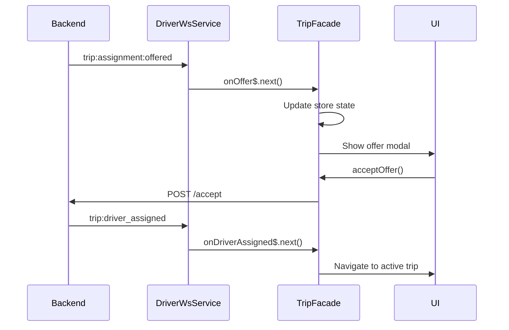

The Rodando Driver app uses Socket.IO WebSockets to receive real-time updates about trip offers, status changes, and passenger actions. This enables instant notifications and smooth trip coordination.

## WebSocket Service Architecture

The `DriverWsService` manages the WebSocket connection and exposes RxJS observables for each event type:

```typescript
@Injectable({ providedIn: 'root' })
export class DriverWsService {
  private auth = inject(AuthStore);
  private socket?: Socket;

  private connected$ = new BehaviorSubject<boolean>(false);
  readonly onConnected$ = this.connected$.asObservable();
  
  // Event observables
  readonly onOffer$ = new Subject<OfferPayload>();
  readonly onDriverAssigned$ = new Subject<DriverAssignedPayload>();
  readonly onArrivingStarted$ = new Subject<ArrivingStartedPayload>();
  readonly onTripStarted$ = new Subject<TripStartedPayload>();
  readonly onTripCompleted$ = new Subject<TripCompletedPayload>();
  readonly onTripCancelled$ = new Subject<TripCancelledPayload>();
}
```

<Info>
**RxJS Subjects:** The service uses RxJS `Subject` to create observables that components can subscribe to for reactive updates.
</Info>

## Establishing Connection

The WebSocket connection is established with authentication and automatic reconnection:

```typescript
connect(): void {
  if (this.socket?.connected) return;

  this.socket = io(`${environment.wsBase}/drivers`, {
    transports: ['websocket'],
    auth: { token: this.auth.accessToken?.() || '' },
    reconnection: true,
    reconnectionAttempts: Infinity,
    reconnectionDelayMax: 5000,
  });

  // Refresh token on reconnect attempts
  this.socket.io.on('reconnect_attempt', () => {
    this.socket!.auth = { token: this.auth.accessToken?.() || '' };
  });

  // Log all incoming events
  this.socket.onAny((evt, ...args) => console.log('[WS] >>>', evt, ...args));

  // Debug listener for broadcast events
  this.socket.on('debug:offered:broadcast', (p: any) => {
    console.log('[WS] debug:offered:broadcast', p);
  });

  this.socket.on('connect', () => this.connected$.next(true));
  this.socket.on('disconnect', () => this.connected$.next(false));
  this.socket.on('connect_error', (e: any) => console.warn('[WS] err', e?.message));
}
```

**Connection Configuration:**

<CardGroup cols={2}>
  <Card title="Authentication" icon="key">
    The access token is sent during connection and refreshed on each reconnect attempt.
  </Card>
  
  <Card title="Transport" icon="network-wired">
    Uses WebSocket transport exclusively for lower latency and better mobile support.
  </Card>
  
  <Card title="Reconnection" icon="rotate">
    Automatic reconnection with infinite attempts and exponential backoff up to 5 seconds.
  </Card>
  
  <Card title="Debugging" icon="bug">
    Logs all events with `onAny()` for comprehensive debugging during development.
  </Card>
</CardGroup>

## Event Types & Payloads

### Trip Assignment Offered

Received when a new trip is available for the driver:

```typescript
this.socket.on('trip:assignment:offered', (p: OfferPayload) => {
  console.log('[WS] trip:assignment:offered', p);
  this.onOffer$.next(p);
});
```

**Payload Structure:**

```typescript
type OfferPayload = {
  assignmentId: string;  // Unique ID for this offer
  tripId: string;        // Trip identifier
  ttlSec: number;        // Time to live in seconds
  expiresAt: string;     // ISO 8601 timestamp when offer expires
};
```

**Example:**

```json
{
  "assignmentId": "asn_9k2j4h5g6f7d8s9a",
  "tripId": "trip_1a2b3c4d5e6f7g8h",
  "ttlSec": 30,
  "expiresAt": "2026-03-09T14:32:45.000Z"
}
```

### Driver Assigned

Received when the driver successfully accepts a trip:

```typescript
this.socket.on('trip:driver_assigned', (p: DriverAssignedPayload) => {
  console.log('[WS] trip:driver_assigned', p);
  this.onDriverAssigned$.next(p);
});
```

**Payload Structure:**

```typescript
type DriverAssignedPayload = {
  tripId: string;
  driverId: string;
  vehicleId: string;
  at: string;  // ISO 8601 timestamp
  currentStatus: 'accepted';
  passenger?: {
    id: string;
    name: string | null;
    photoUrl: string | null;
    phoneMasked: string | null;
  } | null;
};
```

**Example:**

```json
{
  "tripId": "trip_1a2b3c4d5e6f7g8h",
  "driverId": "drv_x9y8z7w6v5u4t3s2",
  "vehicleId": "veh_q1w2e3r4t5y6u7i8",
  "at": "2026-03-09T14:33:15.000Z",
  "currentStatus": "accepted",
  "passenger": {
    "id": "pax_a1b2c3d4e5f6g7h8",
    "name": "María González",
    "photoUrl": "https://cdn.rodando.com/photos/user123.jpg",
    "phoneMasked": "*****6789"
  }
}
```

<Note>
**Passenger Privacy:** Phone numbers are masked to protect passenger privacy while still allowing the driver to identify them.
</Note>

### Arriving Started

Received when the driver starts heading to the pickup location:

```typescript
this.socket.on('trip:arriving_started', (p: ArrivingStartedPayload) => {
  console.log('[WS] trip:arriving_started', p);
  this.onArrivingStarted$.next(p);
});
```

**Payload Structure:**

```typescript
type ArrivingStartedPayload = {
  snapshot: { 
    tripId: string; 
    passengerId: string; 
  };
  at: string;  // ISO 8601 timestamp
};
```

### Trip Started

Received when the trip begins (passenger picked up):

```typescript
this.socket.on('trip:started', (p: TripStartedPayload) => {
  console.log('[WS] trip:started', p);
  this.onTripStarted$.next(p);
});
```

**Payload Structure:**

```typescript
type TripStartedPayload = {
  tripId: string;
  at: string;  // ISO 8601 timestamp
  currentStatus: 'in_progress';
};
```

### Trip Completed

Received when a trip is successfully completed:

```typescript
this.socket.on('trip:completed', (p: TripCompletedPayload) => {
  console.log('[WS] trip:completed', p);
  this.onTripCompleted$.next(p);
});
```

**Payload Structure:**

```typescript
type TripCompletedPayload = {
  tripId: string;
  at: string;  // ISO 8601 timestamp
  currentStatus: 'completed';
  fareTotal?: number | null;
  currency?: string | null;
};
```

**Example:**

```json
{
  "tripId": "trip_1a2b3c4d5e6f7g8h",
  "at": "2026-03-09T15:15:30.000Z",
  "currentStatus": "completed",
  "fareTotal": 125.50,
  "currency": "CUP"
}
```

### Trip Cancelled

Received when a trip is cancelled by passenger or system:

```typescript
this.socket.on('trip:cancelled', (p: TripCancelledPayload) => {
  console.log('[WS] trip:cancelled', p);
  this.onTripCancelled$.next(p);
});
```

**Payload Structure:**

```typescript
type TripCancelledPayload = {
  tripId: string;
  at: string;  // ISO 8601 timestamp
  currentStatus: 'cancelled';
  reason?: string | null;
};
```

## Subscribing to Events

Components and services subscribe to event observables to react to real-time updates:

<Tabs>
  <Tab title="Component Subscription">
    ```typescript
    export class ActiveTripComponent implements OnInit {
      private ws = inject(DriverWsService);
      private tripFacade = inject(TripFacade);

      ngOnInit() {
        // Subscribe to trip started events
        this.ws.onTripStarted$.subscribe((event) => {
          console.log('Trip started:', event);
          // Update UI or trigger actions
        });

        // Subscribe to trip completed events
        this.ws.onTripCompleted$.subscribe((event) => {
          console.log('Trip completed:', event);
          // Show completion summary
        });
      }
    }
    ```
  </Tab>

  <Tab title="Facade Integration">
    ```typescript
    // In TripFacade constructor
    constructor() {
      // Handle trip offers
      this.ws.onOffer$.subscribe(async (offer) => {
        const s = this.store.state();
        
        // Ignore if already handled
        if (this.store.isAssignmentHandled(offer.assignmentId)) {
          return;
        }

        // Ignore if not idle
        if (s.phase !== 'idle') {
          return;
        }

        // Process the offer
        this.store.setActiveTripId(offer.tripId);
        this.store.setOfferAssignmentId(offer.assignmentId);
        this.store.setPhase('assigned');
        await this.refreshTrip();
        this.startCountdown({
          expiresAtIso: offer.expiresAt,
          ttlSec: offer.ttlSec,
        });
        await this.modalSvc.open();
      });
    }
    ```
  </Tab>
</Tabs>

## Connection Lifecycle

Manage the WebSocket connection throughout the app lifecycle:

<Steps>
  <Step title="Connect on Login">
    Establish WebSocket connection after successful authentication:
    
    ```typescript
    async login(credentials: LoginPayload) {
      const result = await this.auth.login(credentials);
      if (result.success) {
        this.ws.connect();  // Connect to WebSocket
      }
    }
    ```
  </Step>

  <Step title="Monitor Connection Status">
    Subscribe to connection status for UI feedback:
    
    ```typescript
    this.ws.onConnected$.subscribe((connected) => {
      if (connected) {
        console.log('WebSocket connected');
        this.showOnlineIndicator();
      } else {
        console.log('WebSocket disconnected');
        this.showOfflineIndicator();
      }
    });
    ```
  </Step>

  <Step title="Disconnect on Logout">
    Clean up WebSocket connection when driver logs out:
    
    ```typescript
    async logout() {
      this.ws.disconnect();  // Close WebSocket
      await this.auth.logout();
    }
    ```
  </Step>
</Steps>

## Disconnection Handling

Properly disconnect and clean up resources:

```typescript
disconnect(): void {
  try {
    this.socket?.removeAllListeners();
    this.socket?.disconnect();
    console.log('[WS] disconnect() called');
  } catch {}
  this.connected$.next(false);
}
```

<Warning>
**Memory Leaks:** Always call `disconnect()` when the driver logs out or the app closes to prevent memory leaks from lingering event listeners.
</Warning>

## Event Flow Diagram



## Debugging WebSocket Events

The service includes comprehensive logging for debugging:

```typescript
// Log all events
this.socket.onAny((evt, ...args) => console.log('[WS] >>>', evt, ...args));

// Log connection events
this.socket.on('connect', () => console.log('[WS] Connected'));
this.socket.on('disconnect', () => console.log('[WS] Disconnected'));
this.socket.on('connect_error', (e) => console.warn('[WS] Error:', e?.message));

// Debug-specific events
this.socket.on('debug:offered:broadcast', (p: any) => {
  console.log('[WS] debug:offered:broadcast', p);
});
```

**Common Issues:**

<AccordionGroup>
  <Accordion title="Connection fails immediately">
    **Cause:** Invalid or expired access token.
    
    **Solution:** Ensure the access token is valid and refresh it if needed before connecting.
  </Accordion>

  <Accordion title="Events not received">
    **Cause:** Not subscribed to the correct event observable or subscription created after event fired.
    
    **Solution:** Subscribe to events in constructor or `ngOnInit()` before they can be emitted.
  </Accordion>

  <Accordion title="Duplicate events">
    **Cause:** Multiple subscriptions to the same observable.
    
    **Solution:** Use `takeUntil()` operator to auto-unsubscribe when component destroys.
  </Accordion>

  <Accordion title="Connection drops frequently">
    **Cause:** Network instability or server-side timeout.
    
    **Solution:** The auto-reconnect will handle this, but check network connectivity and server configuration.
  </Accordion>
</AccordionGroup>

## Best Practices

<CardGroup cols={2}>
  <Card title="Single Connection" icon="plug">
    Maintain only one WebSocket connection per driver session. The service is provided at root level.
  </Card>
  
  <Card title="Event Deduplication" icon="filter">
    Check if events have already been processed before taking action to prevent duplicate handling.
  </Card>
  
  <Card title="Error Recovery" icon="arrows-rotate">
    Let automatic reconnection handle connection drops. Avoid manual reconnection logic.
  </Card>
  
  <Card title="Unsubscribe Cleanup" icon="trash">
    Use RxJS `takeUntil()` or Angular's `AsyncPipe` to automatically clean up subscriptions.
  </Card>
</CardGroup>

## Related Documentation

- [Trip Management](/features/trip-management) - Using WebSocket events for trip lifecycle
- [Authentication](/features/authentication) - Token-based WebSocket authentication
- [Earnings Tracking](/features/earnings-tracking) - Real-time earnings updates