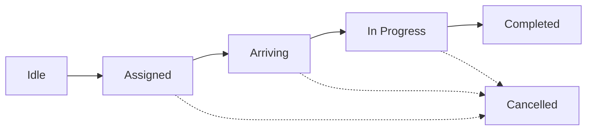

The trip management system handles the complete lifecycle of a ride from driver assignment through completion, including real-time updates, fare calculations, and waiting time penalties.

## Trip Lifecycle

A trip progresses through several distinct phases:



<Steps>
  <Step title="Idle">
    Driver is online and waiting for trip offers.
  </Step>
  
  <Step title="Assigned">
    Driver receives and accepts a trip assignment. Countdown timer shows time to accept/decline.
  </Step>
  
  <Step title="Arriving">
    Driver is en route to pickup location. Waiting time tracking begins when driver marks arrival.
  </Step>
  
  <Step title="In Progress">
    Trip is active - driver has picked up passenger and is heading to destination.
  </Step>
  
  <Step title="Completed">
    Trip finished successfully with final fare calculation including any waiting fees.
  </Step>
</Steps>

## Trip State Management

The `TripStore` maintains all trip-related state using Angular signals:

```typescript
interface DriverTripState {
  status: 'idle' | 'loading' | 'success' | 'error';
  error: string | null;

  activeTripId: string | null;
  trip: TripDto | null;
  phase: TripPhase;
  offerAssignmentId: string | null;

  // Offer countdown
  offerExpiresAt?: string | null;
  remainingSec: number | null;

  // Modal state
  modalOpen: boolean;

  // Deduplication
  handledAssignments: string[];
  
  // Passenger info
  passengerSlim: {
    id: string;
    name: string | null;
    phoneMasked: string | null;
    photoUrl: string | null;
  } | null;

  // Timing
  arrivedPickupAt: string | null;

  // Pricing & waiting fees
  baseFare: number | null;
  baseCurrency: string | null;
  liveFare: number | null;
  waitingSinceAt: string | null;
  waitingSeconds: number;
  waitingPenaltyApplied: boolean;
  waitingPenaltyText: string | null;
  waitingExtraFare: number | null;
  waitingReason: string | null;
}
```

<Info>
The store uses **Angular signals** for reactive state management, providing automatic change detection and computed values.
</Info>

## Receiving Trip Offers

When a trip offer arrives via WebSocket, the facade handles it automatically:

```typescript
// In TripFacade constructor
this.ws.onOffer$.subscribe(async (offer) => {
  const s = this.store.state();

  console.log('[TripFacade] onOffer$', offer, 'state=', s);

  // Prevent duplicate handling
  if (this.store.isAssignmentHandled(offer.assignmentId)) {
    console.log('[TripFacade] ignoring offer: assignment already handled');
    return;
  }

  // Only accept offers when idle
  if (s.phase !== 'idle') {
    console.log(
      '[TripFacade] ignoring offer because phase =',
      s.phase,
      'activeTripId =',
      s.activeTripId,
    );
    return;
  }

  // Update state
  this.store.setActiveTripId(offer.tripId);
  this.store.setOfferAssignmentId(offer.assignmentId);
  this.store.setPhase('assigned');

  // Load trip details
  await this.refreshTrip();
  
  // Start countdown timer
  this.startCountdown({
    expiresAtIso: offer.expiresAt,
    ttlSec: offer.ttlSec,
  });

  // Show modal
  await this.modalSvc.open();
});
```

**Offer Payload:**

```typescript
type OfferPayload = {
  assignmentId: string;  // Unique offer ID
  tripId: string;        // Trip identifier
  ttlSec: number;        // Time to live in seconds
  expiresAt: string;     // ISO timestamp when offer expires
};
```

## Accepting Trip Offers

Drivers can accept offers through the modal interface:

```typescript
async acceptOffer(): Promise<void> {
  const s = this.store.state();
  const assignmentId = s.offerAssignmentId;
  if (!assignmentId) return;

  console.log('[TripFacade] acceptOffer CLICK', { assignmentId, state: s });

  try {
    this.stopCountdown();

    const res = await this.tripsApi
      .acceptAssignment(assignmentId)
      .pipe(take(1))
      .toPromise();

    console.log('[TripFacade] acceptOffer HTTP OK', res);

    await this.refreshTrip();
    console.log('[TripFacade] state after refreshTrip', this.store.state());

    // Mark as handled to prevent duplicate processing
    this.store.markAssignmentHandled(assignmentId);
    this.store.setOfferAssignmentId(null);
    this.store.setPhase('assigned');

    await this.modalSvc.close('accepted');

    console.log('[TripFacade] navegando a /trips/active');
    await this.router.navigate(['/trips/active']);
  } catch (e) {
    console.error('[TripFacade] acceptOffer ERROR', e);
    this.store.setError(
      (e as any)?.error?.message ?? 'No se pudo aceptar la oferta',
    );
  }
}
```

## Declining Trip Offers

Drivers can decline offers they don't want to accept:

```typescript
async declineOffer(): Promise<void> {
  const s = this.store.state();
  const assignmentId = s.offerAssignmentId;
  if (!assignmentId) return;

  console.log('[TripFacade] declineOffer CLICK', { assignmentId, state: s });

  try {
    this.stopCountdown();

    await this.tripsApi
      .declineAssignment(assignmentId)
      .pipe(take(1))
      .toPromise();

    await this.refreshTrip();

    this.store.markAssignmentHandled(assignmentId);
    this.store.setOfferAssignmentId(null);
    this.store.setPhase('idle');

    await this.modalSvc.close('declined');

  } catch (e) {
    console.error('[TripFacade] declineOffer ERROR', e);
    this.store.setError(
      (e as any)?.error?.message ?? 'No se pudo rechazar la oferta',
    );
  }
}
```

## Offer Countdown Timer

The countdown timer shows drivers how long they have to respond:

```typescript
startCountdown(opts: { expiresAtIso?: string; ttlSec?: number }) {
  this.stopCountdown();

  let remaining = 0;
  if (opts.expiresAtIso) {
    remaining = Math.max(
      0,
      Math.floor((Date.parse(opts.expiresAtIso) - Date.now()) / 1000),
    );
  } else if (typeof opts.ttlSec === 'number') {
    remaining = Math.max(0, Math.floor(opts.ttlSec));
  } else {
    remaining = 20;
  }

  this.store.setOfferCountdown(opts.expiresAtIso ?? null, remaining);

  this.countdownSub = interval(1000).subscribe(async () => {
    this.store.tickCountdown();
    const r = this.store.state().remainingSec ?? 0;
    if (r <= 0) {
      this.stopCountdown();
      await this.modalSvc.close('timeout');
    }
  });
}
```

<Warning>
**Automatic Timeout:** If the driver doesn't respond before the countdown reaches zero, the offer is automatically closed and marked as timed out.
</Warning>

## Marking Arrival at Pickup

When the driver arrives at the pickup location:

```typescript
async markArrivedPickup(): Promise<void> {
  const s = this.store.state();
  const tripId = s.activeTripId;
  const driverId = this.getCurrentDriverId();

  if (!tripId || !driverId) {
    console.warn('[TripFacade] markArrivedPickup sin tripId o driverId');
    return;
  }

  try {
    const res = await this.tripsApi
      .markArrivedPickup(tripId, driverId)
      .pipe(take(1))
      .toPromise();

    const arrivedAt =
      (res as any)?.arrivedPickupAt ??
      (res as any)?.arrived_pickup_at ??
      new Date().toISOString();

    this.store.setArrivedPickup(arrivedAt);
    this.store.setPhase('arriving');
    this.store.setTrip(res as any);

    // Start waiting time tracking
    this.store.startWaiting(arrivedAt);
    this.startWaitingTimer();
  } catch (e) {
    console.error('[TripFacade] markArrivedPickup ERROR', e);
    this.store.setError(
      (e as any)?.error?.message ??
      'No se pudo marcar llegada al punto de recogida',
    );
  }
}
```

## Waiting Time Tracking

The system automatically tracks waiting time and applies penalties when appropriate:

```typescript
private startWaitingTimer() {
  this.stopWaitingTimer();
  this.waitingAlertShown = false;

  this.waitingTimerSub = interval(1000).subscribe(() => {
    const s = this.store.state();
    if (!s.activeTripId || s.phase !== 'arriving' || !s.arrivedPickupAt) {
      this.stopWaitingTimer();
      return;
    }

    // Increment waiting seconds
    this.store.tickWaiting(1);

    // Apply penalty after threshold (5 seconds in demo, configurable in production)
    const s2 = this.store.state();
    if (s2.waitingSeconds >= 5 && !s2.waitingPenaltyApplied) {
      const base = s2.baseFare ?? 0;
      const extra = Math.max(1, Math.round(base * 0.05)); // 5% or minimum 1
      const text = `Se aplicó un recargo por espera (${s2.waitingSeconds} s).`;

      this.store.applyWaitingPenalty(extra, text);
      this.store.setWaitingReason('Espera prolongada en el punto de recogida');

      if (!this.waitingAlertShown) {
        this.waitingAlertShown = true;
        this.presentWaitingPenaltyModal();
      }
    }
  });
}
```

<Note>
**Waiting Fee Calculation:** The waiting fee is calculated as 5% of the base fare with a minimum of 1 unit. This percentage and threshold are configurable.
</Note>

## Starting the Trip

Once the passenger is in the vehicle:

```typescript
async startTrip(): Promise<void> {
  const s = this.store.state();
  const tripId = s.activeTripId;
  const driverId = this.getCurrentDriverId();

  if (!tripId || !driverId) {
    console.warn('[TripFacade] startTrip sin tripId o driverId');
    return;
  }

  try {
    await this.tripsApi
      .startTrip(tripId, driverId)
      .pipe(take(1))
      .toPromise();

    this.store.setPhase('in_progress');
    this.stopWaitingTimer();
    await this.refreshTrip();
  } catch (e) {
    console.error('[TripFacade] startTrip ERROR', e);
    this.store.setError(
      (e as any)?.error?.message ?? 'No se pudo iniciar el viaje',
    );
  }
}
```

## Completing the Trip

The completion flow includes fare confirmation and payment collection:

```typescript
async completeTrip(): Promise<void> {
  const s = this.store.state();
  const tripId = s.activeTripId;
  const driverId = this.getCurrentDriverId();
  const trip: any = s.trip;

  if (!tripId || !driverId) {
    console.warn('[TripFacade] completeTrip sin tripId o driverId');
    return;
  }

  // Calculate amounts for confirmation modal
  const base =
    s.baseFare ??
    trip?.fareEstimatedTotal ??
    trip?.fareFinalTotal ??
    null;

  const extra = s.waitingExtraFare ?? 0;

  const finalTotal =
    trip?.fareFinalTotal ??
    s.liveFare ??
    (base != null ? base + extra : null);

  const cur =
    s.baseCurrency ??
    trip?.fareFinalCurrency ??
    trip?.fareEstimatedCurrency ??
    'CUP';

  const passengerName =
    s.passengerSlim?.name ??
    trip?.passenger?.name ??
    'Pasajero';

  const m = this.store.modalVm();

  // Show payment confirmation modal
  const modal = await this.modalCtrl.create({
    component: DriverConfirmOrderModalComponent,
    componentProps: {
      passengerName,
      originLabel: m.originLabel,
      destinationLabel: m.destinationLabel,
      distanceText: m.distanceText,
      durationText: m.durationText,
      base,
      waitingExtra: extra || null,
      total: finalTotal,
      currency: cur,
      waitingSeconds: s.waitingSeconds,
      waitingReason: s.waitingReason ?? s.waitingPenaltyText,
      paymentMode: trip?.paymentMode ?? 'cash',
    },
    cssClass: 'driver-confirm-order-modal',
    backdropDismiss: false,
  });

  await modal.present();
  const { data, role } = await modal.onDidDismiss();

  // If driver cancels, don't complete
  if (role !== 'confirm' || !data?.confirmed) {
    return;
  }

  // Build final payload for backend
  const waitingSeconds = s.waitingSeconds ?? 0;
  const waitingMinutes =
    waitingSeconds > 0 ? Math.max(1, Math.round(waitingSeconds / 60)) : null;

  const extraFees = extra || null;
  const waitingReason = s.waitingPenaltyApplied
    ? s.waitingReason ?? 'Recargo por espera en el punto de recogida'
    : null;

  const payload: CompleteTripPayload = {
    driverId,
    extraFees,
    waitingTimeMinutes: waitingMinutes,
    waitingReason,
  };

  try {
    const res = await this.tripsApi
      .completeTrip(tripId, payload)
      .pipe(take(1))
      .toPromise();

    this.store.setPhase('completed');

    if (res) {
      this.store.setTrip(res as any);
    }
  } catch (e) {
    console.error('[TripFacade] completeTrip ERROR', e);
    this.store.setError(
      (e as any)?.error?.message ?? 'No se pudo finalizar el viaje',
    );
  }
}
```

**Completion Payload:**

```typescript
interface CompleteTripPayload {
  driverId: string;
  actualDistanceKm?: number | null;
  actualDurationMin?: number | null;
  extraFees?: number | null;           // Waiting fees
  waitingTimeMinutes?: number | null;  // Total waiting time
  waitingReason?: string | null;       // Reason for waiting charge
}
```

## Trip Data Model

```typescript
interface TripDto {
  id: string;
  currentStatus: 'pending' | 'assigning' | 'accepted' | 'arriving' | 
                 'in_progress' | 'completed' | 'cancelled' | 'no_drivers_found';
  pickupAddress?: string | null;
  pickupPoint?: { lat: number; lng: number } | null;
  stops?: TripStopDto[];
  fareSnapshot?: FareSnapshotDto | null;
  requestedVehicleCategory?: { id: string; name?: string } | null;
  requestedServiceClass?: { id: string; name?: string } | null;
  fareEstimatedTotal?: number | null;
  fareFinalCurrency?: string | null;
  fareDistanceKm?: number | null;
  fareDurationMin?: number | null;
}

interface TripStopDto {
  seq: number;
  point: { lat: number; lng: number } | null;
  address?: string | null;
}

interface FareSnapshotDto {
  currency: string;
  surgeMultiplier?: number | null;
  breakdown?: any;
  distanceKmEst?: number | null;
  durationMinEst?: number | null;
  estimatedTotal?: number | null;
}
```

## Computed Modal View Model

The store provides a computed view model optimized for the trip modal:

```typescript
readonly modalVm = computed(() => {
  const s = this._s();
  const t = s.trip;

  // Origin
  const originLabel =
    (t?.pickupAddress && t.pickupAddress.trim()) ||
    (t?.pickupPoint ? `${t.pickupPoint.lat.toFixed(6)}, ${t.pickupPoint.lng.toFixed(6)}` : '—');

  // Destination
  const stop0 = t?.stops && t.stops.length ? t.stops[0] : null as any;
  const destinationLabel =
    (stop0?.address && stop0.address.trim()) ||
    (stop0?.point ? `${stop0.point.lat.toFixed(6)}, ${stop0.point.lng.toFixed(6)}` : '—');

  // Distance/duration/cost
  const distanceKm  = typeof t?.fareDistanceKm  === 'number' ? t.fareDistanceKm  : null;
  const durationMin = typeof t?.fareDurationMin === 'number' ? t.fareDurationMin : null;
  const total       = typeof t?.fareEstimatedTotal === 'number' ? t.fareEstimatedTotal : null;
  const currency    = t?.fareFinalCurrency || 'CUP';

  // Formatted text
  const distanceText = distanceKm  != null ? `${distanceKm < 10 ? distanceKm.toFixed(1) : Math.round(distanceKm)} km` : '—';
  const durationText = durationMin != null ? `≈ ${Math.round(durationMin)} min` : '—';
  const priceText    = total != null ? `${total} ${currency}` : '—';

  return {
    phase: s.phase,
    remainingSec: s.remainingSec ?? 0,
    originLabel,
    destinationLabel,
    distanceText,
    durationText,
    priceText,
    distanceKm, durationMin, total, currency,
  };
});
```

## WebSocket Event Handling

The facade subscribes to various WebSocket events for real-time updates:

<Tabs>
  <Tab title="Driver Assigned">
    ```typescript
    this.ws.onDriverAssigned$.subscribe(async (p) => {
      console.log('[TripFacade] onDriverAssigned$', p);
      this.store.setActiveTripId(p.tripId);
      this.store.setPhase('assigned');

      if (p.passenger) {
        this.store.setPassengerSlim({
          id: p.passenger.id,
          name: p.passenger.name,
          phoneMasked: p.passenger.phoneMasked,
          photoUrl: p.passenger.photoUrl,
        });
      }

      await this.refreshTrip();
    });
    ```
  </Tab>

  <Tab title="Arriving Started">
    ```typescript
    this.ws.onArrivingStarted$.subscribe(async (ev) => {
      console.log('[TripFacade] onArrivingStarted$', ev);
      const active = this.store.state().activeTripId;
      if (!active || ev.snapshot.tripId !== active) return;
      this.store.setPhase('arriving');
      await this.modalSvc.close('arriving');
      await this.refreshTrip();
    });
    ```
  </Tab>

  <Tab title="Trip Started">
    ```typescript
    this.ws.onTripStarted$.subscribe(async (p) => {
      console.log('[TripFacade] onTripStarted$', p);
      const active = this.store.state().activeTripId;
      if (!active || p.tripId !== active) return;

      this.store.setPhase('in_progress');
      await this.refreshTrip();
    });
    ```
  </Tab>

  <Tab title="Trip Completed">
    ```typescript
    this.ws.onTripCompleted$.subscribe(async (p) => {
      console.log('[TripFacade] onTripCompleted$', p);
      const active = this.store.state().activeTripId;
      if (!active || p.tripId !== active) return;

      this.store.setPhase('completed');
      await this.refreshTrip();
    });
    ```
  </Tab>

  <Tab title="Trip Cancelled">
    ```typescript
    this.ws.onTripCancelled$.subscribe(async (p) => {
      console.log('[TripFacade] onTripCancelled$', p);
      const active = this.store.state().activeTripId;
      if (!active || p.tripId !== active) return;

      this.store.setPhase('cancelled');
      await this.refreshTrip();
    });
    ```
  </Tab>
</Tabs>

## Best Practices

<CardGroup cols={2}>
  <Card title="Deduplication" icon="fingerprint">
    Always check `isAssignmentHandled()` to prevent processing the same offer multiple times.
  </Card>
  
  <Card title="State Validation" icon="shield-check">
    Validate current phase before processing events to prevent state conflicts.
  </Card>
  
  <Card title="Error Handling" icon="circle-exclamation">
    Always wrap API calls in try-catch and update the error state for user feedback.
  </Card>
  
  <Card title="Timer Cleanup" icon="broom">
    Stop timers when transitioning phases to prevent memory leaks and duplicate updates.
  </Card>
</CardGroup>

## Related Documentation

- [Real-Time Updates](/features/real-time-updates) - WebSocket events for trips
- [Earnings Tracking](/features/earnings-tracking) - Trip fare calculations
- [Authentication](/features/authentication) - Authenticated API requests